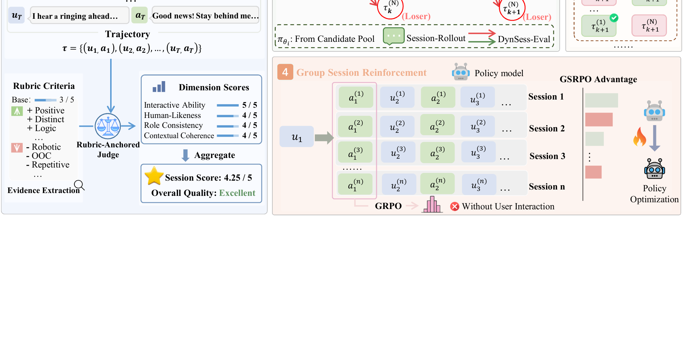
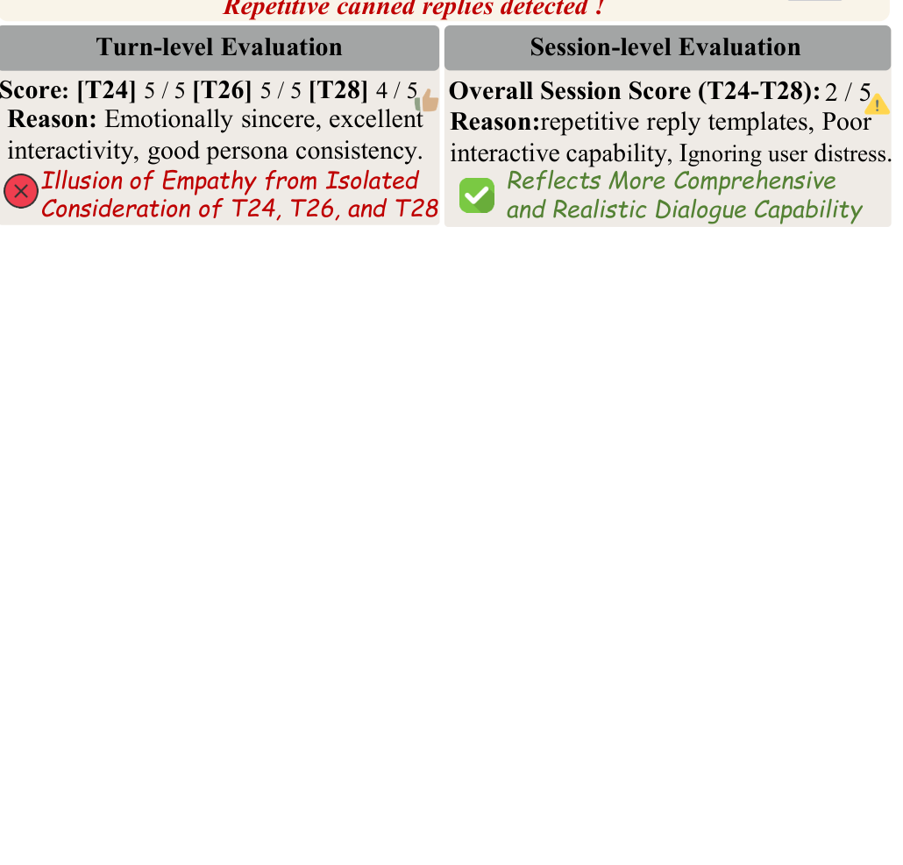

# DynSess
[](./LICENSE)
[](https://www.python.org/)
[](https://2026.emnlp.org/)
 - [*DynSess: Dynamic Session-Level Evaluation and Optimization Framework for Role-Playing Agents*](https://arxiv.org/)

> Official code for **"DynSess: Dynamic Session-Level Evaluation and Optimization Framework for Role-Playing Agents"** (EMNLP 2026). Role-playing with LLMs is a **session-level** task: an agent must sustain character identity and interaction quality across extended, multi-turn conversations. **DynSess** couples evaluation and optimization through a shared session-level reward.

## 🔔 News
- **`2026-08`** We release the [[Repo](https://github.com/tangbupt/DynSess)] for our **`EMNLP 2026`** paper.
- **`2026-05`** Our paper: *DynSess: Dynamic Session-Level Evaluation and Optimization Framework for Role-Playing Agents* was accepted by **`EMNLP 2026`**.

## 🌈 Framework


> **DynSess-Eval** (left) simulates multi-turn user–agent sessions and scores them across four dimensions via a rubric-anchored judge. **DynSess-Character** (right) leverages these session-level rewards to construct trajectories through multi-turn lookahead search for SFT, and aligns the agent via off-policy **DSPO** or on-policy **GSRPO**.

## 📊 Results

**Alignment with human judgments** — DynSess-Eval (Session-Level) leads on Rank Accuracy and Normalized MAE across all four dimensions.

| Eval Method | Inter. Rank↑ | Role Rank↑ | Context MAE↓ |
|---|---|---|---|
| CharacterJudge (Turn) | 0.27 | 0.53 | 0.54 |
| RMTBench (Pseudo-Session) | 0.33 | 0.50 | 0.50 |
| CharacterArena (Trajectory) | 0.53 | 0.57 | — |
| **DynSess-Eval (Session)** | **0.83** | **0.67** | **0.22** |

**Role-playing model performance** (human eval, 10-turn) — DynSess-Character-32B matches the ~200B proprietary baseline at ~6× parameter efficiency.

| Model | Params | Avg | Role |
|---|---|---|---|
| GPT-5.4 | — | 3.31 | 3.38 |
| Doubao-1.5-pro-character | ~200B | **3.38** | 3.47 |
| **DynSess-Character-32B (DSPO)** | 32B | 3.37 | **3.56** |
| **DynSess-Character-32B (GSRPO)** | 32B | 3.35 | 3.46 |

<details>
<summary><b>Case study & session-length analysis</b></summary>

<p align="center"></p>

<p align="center"></p>

<p align="center"></p>

</details>

## 📦 Data Download
- **Personas.** 2,100 character personas (2,000 train / 100 held-out test), spanning celebrities, literary/media, game, social, and non-human characters.
- **Seed sessions.** 100 seed persona+history records in [`data/test_dialogue_0424.jsonl`](./data/test_dialogue_0424.jsonl) (~841 KB, `continue`-mode input).
- **Training-format samples.** 2-line examples of each SFT/DPO format in [`data/train_samples/`](./data/train_samples) so you can prepare your own corpora.

> The full SFT/DPO corpora (~512 MB) and the `persona_general` checkpoint are **not** bundled (size). Provide your own training data under `train_data/` and run the `training/` scripts to reproduce. The shipped auto-eval stats across 89 runs are in [`results/eval_summary.json`](./results/eval_summary.json) (overall mean 4.18).

## 📕 Code Path

#### Code Structures
There are three parts in the code.
- **`run_dynsess_eval.py`**: the 3-stage eval pipeline (generate → format → rubric-anchored judge).
- **`dynsess_rubrics.py`**: the four multi-turn judge rubrics (Interactive Ability / Human-likeness / Role Consistency / Contextual Coherence, 1–5, anchored at 3).
- **`training/`**: SFT/DPO → multi-turn session-level training-data construction (`convert_dpo_to_session_merge.py` is the canonical prefix-chain merge).

<details>
<summary><b>Full tree</b></summary>

```
DynSess/
├── run_dynsess_eval.py            # 3-stage eval pipeline
├── dynsess_rubrics.py             # the four multi-turn judge rubrics
├── training/                      # SFT/DPO → multi-turn training-data construction
│   ├── convert_to_train.py
│   ├── convert_dpo_to_train.py
│   ├── convert_dpo_to_train_dedup.py
│   └── convert_dpo_to_session_merge.py   # canonical prefix-chain merge
├── data/
│   ├── test_dialogue_0424.jsonl              # 100 seed sessions
│   └── train_samples/                        # 2-line samples of each training format
├── results/                       # aggregate eval stats + example result
├── assets/figures/                # figures rendered from the paper
├── requirements.txt
├── .env.example
├── LICENSE
└── README.md
```
</details>

## 🔬 Dependencies

- ```Python 3.8+```
- ```openai```, `requests`, `numpy`, `tqdm```` (the only runtime deps)
- Install:
```bash
pip install -r requirements.txt
```

DynSess loads **all credentials from environment variables** — no keys are stored in the repo. Copy [`.env.example`](./.env.example) to `.env` (or `export` in your shell):

```bash
export ARK_API_KEY=<volcengine-ark-key>            # user simulator (Doubao)
export LOCAL_VLLM_URL=http://localhost:88/v1/chat/completions   # role-playing model
export EVAL_API_URL=<your-openai-compatible-judge-endpoint>
export DYNS_EVAL_API_TOKEN=<your-judge-token>
```

## 🚀 Train & Eval

### Evaluate a role-playing model
Edit the config block at the top of [`run_dynsess_eval.py`](./run_dynsess_eval.py) to point `LOCAL_VLLM_URL` / `LOCAL_MODEL_NAME` at your model, then:
```shell
python run_dynsess_eval.py
```
Outputs land under `./evaluate/` (generated sessions → merged formats → per-record scores + statistics). The pipeline is **resumable** — re-running continues from `progress.json`.

### Build training data
```shell
cd training
python convert_to_train.py                          # SFT corpus
python convert_dpo_to_session_merge.py              # DPO → multi-turn (canonical merge)
```

### [Parameter](#content)
```
[--GENERATE_MODE {continue,scratch}] [--BATCH_SIZE] [--STAGE1_MAX_WORKERS] [--MAX_WORKERS] [--SKIP_STAGE1]
[--LOCAL_MODEL_NAME] [--ASSISTANT_MODEL {local,api}] [--LOCAL_VLLM_URL] [--EVAL_API_URL]
```
**Note**: edit the config block at the top of `run_dynsess_eval.py` for <a href="#Parameter">parameter</a> modification.

## 🤝 Cite
Please consider citing this paper if you use the ```code``` or ```data``` from our work. Thanks a lot :)

```bibtex
@inproceedings{dynsess2026,
  title     = {DynSess: Dynamic Session-Level Evaluation and Optimization Framework for Role-Playing Agents},
  author    = {Zhang, Rongsheng and Tang, Jiji and Ren, Junnan and Bao, Zuyi and Chen, Weijie and Hu, Ruofan and Lv, Tangjie and Zhao, Zhou and Zhang, Yan},
  booktitle = {Proceedings of the 2026 Conference on Empirical Methods in Natural Language Processing (EMNLP)},
  year      = {2026}
}
```

## 📄 License
Released under the [MIT License](./LICENSE).

## 🙏 Acknowledgements
The default judge was developed against an internal NetEase Fuxi LLM gateway; the user simulator defaults to Volcengine Doubao-1.5-pro-32k-character.
