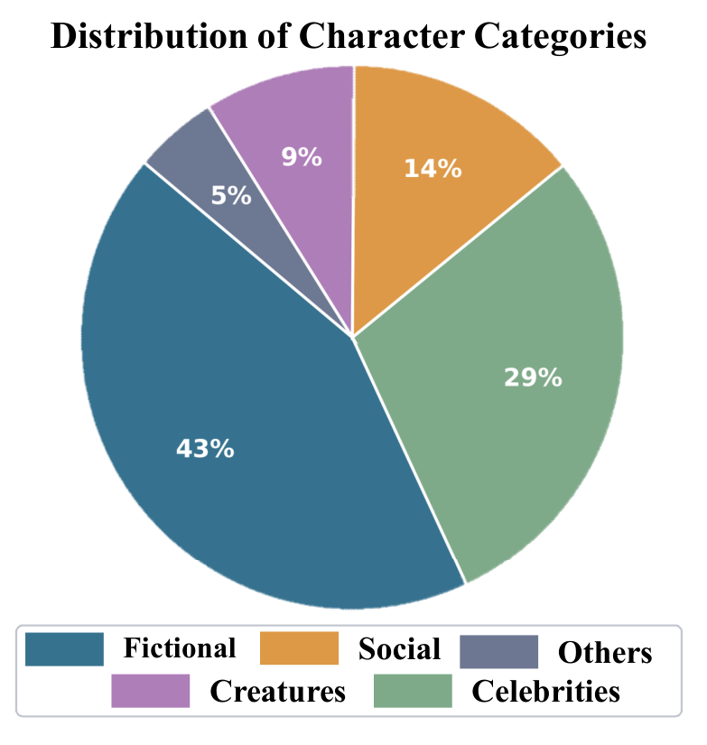

# DynSess: Dynamic Session-Level Evaluation and Optimization Framework for Role-Playing Agents

[](./LICENSE)
[](https://www.python.org/)

> Official code for **"DynSess: Dynamic Session-Level Evaluation and Optimization Framework for Role-Playing Agents"** (EMNLP).

Role-playing with large language models is fundamentally a **session-level** task: an agent must
sustain character identity and interaction quality across extended, multi-turn conversations. Yet
existing evaluation and optimization methods remain largely turn-level, failing to capture
long-horizon quality. **DynSess** is a unified session-level framework that couples evaluation and
optimization through a shared session-level reward:

- **DynSess-Eval** scores complete dialogue sessions via a **rubric-anchored judge** targeting
  long-horizon behaviors along four dimensions.
- **DynSess-Character** leverages these session-level rewards to construct high-quality training
  trajectories through **multi-turn lookahead search**, then aligns the agent with two
  complementary variants: **DSPO** (off-policy) and **GSRPO** (on-policy).

---

## Table of Contents
- [Overview](#overview)
- [Method](#method)
- [Repository Structure](#repository-structure)
- [Installation](#installation)
- [Configuration](#configuration)
- [Quick Start](#quick-start)
- [Results](#results)
- [Rebuttal / Supplementary Experiments](#rebuttal--supplementary-experiments)
- [Data & Checkpoints](#data--checkpoints)
- [Citation](#citation)
- [License](#license)
- [Acknowledgements](#acknowledgements)

---

## Overview

Most existing role-playing benchmarks evaluate models on short, single-turn exchanges. This hides
failure modes that only appear as a conversation grows: gradual persona drift, repetitive
template loops, loss of accumulated context, and declining interactivity. DynSess addresses this by
treating evaluation as a **dynamic session**.

<p align="center">
  
</p>

> **Turn-level vs. session-level evaluation.** An agent trapped in a rigid follow-up-question
> template scores high on every isolated turn, yet exhibits a repetitive, mechanical pattern across
> the session. Turn-level metrics reward local engagement but miss global incoherence — role-playing
> quality emerges across turns, not within any single one.

The framework is **model-agnostic**: any OpenAI-compatible endpoint (vLLM, SGLang, Ollama, or a
hosted API) can serve as the role model, the user simulator, or the judge.

## Method

<p align="center">
  
</p>

> **Overview.** DynSess-Eval (left) simulates multi-turn user–agent sessions and scores them along
> four dimensions via a rubric-anchored judge. DynSess-Character (right) leverages these
> session-level rewards to construct trajectories through multi-turn lookahead search for SFT, and
> further aligns the agent via off-policy DSPO or on-policy GSRPO.

### DynSess-Eval — Dynamic Session-Level Evaluation

Turn-level evaluation — generating a single reply given a fixed history — lacks the longitudinal
perspective to track behavioral drift and accounts for dynamic user engagement poorly. DynSess-Eval
transitions from static evaluation to **dynamic interaction** by introducing a user simulator.

An evaluation instance is initialized with a target character persona $P_C$ and an optional initial
context $H_0$. We first synthesize a user persona $P_U$ via a derivation module, then simulate a
$T$-turn interactive session by alternating between the user simulator $\pi_{\text{user}}$ and the
character agent $\pi_\theta$, each conditioned on its persona and the preceding context $H_{t-1}$.
The resulting $T$-turn session is $\tau = H_T$.

**Rubric-anchored session scoring.** Evaluating subjective tasks with standard LLM-as-a-judge
prompts often yields inflated and unstable scores. DynSess-Eval decouples **evidence extraction**
from **score aggregation**: the judge $J$ first extracts the triggered session-level criteria
$\mathcal{E}_d(\tau)$ for each dimension, then aggregates their signed weights $w_c$ around a
neutral baseline $b_d$:

$$s_d(\tau) = \mathrm{clip}\!\left(b_d + \sum_{c \in \mathcal{E}_d(\tau)} w_c,\; s_{\min},\; s_{\max}\right)$$

Positive weights reward desirable long-horizon behaviors (e.g. memory utilization); negative ones
penalize failure patterns (e.g. gradual persona drift, repetitive loops). Both $w_c$ and $b_d$ are
calibrated on a small set of human-annotated sessions. Following common role-playing evaluation
practice, agents are assessed across four dimensions:

| Dimension | Core question |
|-----------|---------------|
| **Interactive Ability** | Does it engage naturally with the user's implicit cues and proactively advance the scene? |
| **Human-likeness** | Does it sustain convincing human texture across turns, or drift into mechanical templates? |
| **Role Consistency** | Does it stay in character throughout the whole session? |
| **Contextual Coherence** | Does it remain coherent with the accumulated dialogue history? |

The overall score is the mean of the four dimensions. The rubrics live in
[`dynsess_rubrics.py`](./dynsess_rubrics.py); a session is scored only on its *continued* turns
given the *history* turns as context. The default judge is `gemini-3-flash-preview`; the default
user simulator is `doubao-1.5-pro-32k-character`.

### DynSess-Character — Dynamic Session-Level Optimization

Driven by the accuracy of DynSess-Eval in capturing long-horizon behavior, DynSess-Character uses
the reward signal $s_d(\tau)$ in three stages.

**1. Reward-driven trajectory construction (multi-turn lookahead search).**
Conventional synthetic dialogues are generated myopically, turn by turn, so minor early deviations
compound into perfunctory replies and flat sessions. DynSess-Character divides a session of total
length $T \times K$ into $K$ sequential lookahead steps. At each step, $N_s$ candidate models are
sampled from a global pool of $N$ models and roll out $T$-turn segments from the same committed
prefix $\mathcal{H}_{k-1}$. The highest-scoring segment is appended to the prefix, while the
remaining candidates form segment-level preference pairs. In the main experiments $N{=}5$,
$N_s{=}2$, $T{=}10$, $K{=}5$, producing committed 50-turn trajectories for SFT and segment-level
preference pairs for DSPO.

**2. DSPO — off-policy session alignment.**
Direct Preference Optimization (DPO) lifts poorly to role-playing because its turn-level
preference $(a^w \succ a^l)$ cannot capture long-horizon behavior. **Direct Session Preference
Optimization (DSPO)** lifts the preference unit to $T$-turn segments $(\tau^w_k, \tau^l_k)$, each
pair selected by the judge under the same prefix $\mathcal{H}_{k-1}$:

$$\mathcal{L}_{\text{DSPO}} = -\mathbb{E}_{(\tau^w_k, \tau^l_k)\sim\mathcal{R}}\!\left[\log\sigma\!\left(r_\theta(\tau^w_k) - r_\theta(\tau^l_k)\right)\right],\quad r_\theta(\tau) = \beta\log\frac{\pi_\theta(\tau\mid\mathcal{H}_{k-1}, P_C)}{\pi_{\text{ref}}(\tau\mid\mathcal{H}_{k-1}, P_C)}$$

Gradients flow only over the character tokens within $\tau$, excluding user-simulator tokens.

**3. GSRPO — on-policy session RL.**
Standard GRPO samples $M$ responses to a single prompt and normalizes within-group rewards; this
breaks down in role-playing, where character quality emerges only across turns and single-turn
rewards are noisy. **Group Session Relative Policy Optimization (GSRPO)** rolls out $M$ full
sessions $\{\tau^m\}$ under a shared context, scores each with the session-level judge, and
broadcasts the group-normalized advantage $\hat{A}_m$ only over the character token set:

$$\hat{A}_m = \frac{r_m - \mu_r}{\sigma_r + \varepsilon},\quad r_m = \tfrac{1}{D}\sum_d s_d(\tau^m)$$

> **What this repository ships.** The repo contains the **DynSess-Eval pipeline** (dynamic session
> generation → format conversion → rubric-anchored judging) and the **training-data construction**
> utilities that convert SFT/DPO corpora into multi-turn session-level samples. The DSPO/GSRPO
> training configurations and the `persona_general` checkpoint are paper-internal and are **not**
> bundled here; see [Data & Checkpoints](#data--checkpoints) for how to reproduce.

## Repository Structure

```
DynSess/
├── run_dynsess_eval.py            # 3-stage eval pipeline (generate → format → judge)
├── dynsess_rubrics.py             # the four multi-turn judge rubrics
├── training/                      # SFT/DPO → multi-turn training-data construction
│   ├── convert_to_train.py
│   ├── convert_dpo_to_train.py
│   ├── convert_dpo_to_train_dedup.py
│   └── convert_dpo_to_session_merge.py   # canonical prefix-chain merge
├── data/
│   ├── test_dialogue_0424.jsonl              # 100 seed sessions (continue-mode input)
│   └── train_samples/                        # 2-line samples of each training format
├── results/
│   ├── eval_summary.json                     # aggregate stats across 89 eval runs
│   └── example_eval_result.json              # trimmed example of a final.json
├── rebuttal/                    # supplementary experiments (see section below)
│   ├── base/                                # reference, unmodified pipeline
│   ├── different_user_simulation/           # passive/balanced/proactive user simulators
│   ├── longer_context/                      # long-context & persona-corruption robustness
│   └── run_data_ablation/                   # rollout-budget / best-of-N ablation
├── assets/figures/               # figures rendered from the paper (LaTeX source in paper/)
├── paper/                        # EMNLP camera-ready LaTeX source (for reference)
├── requirements.txt
├── .env.example
├── LICENSE
└── README.md
```

## Installation

```bash
git clone <this-repo>
cd DynSess
pip install -r requirements.txt
```

`openai`, `requests`, `numpy`, and `tqdm` are the only runtime dependencies.

## Configuration

DynSess loads **all credentials from environment variables** — no keys are stored in the
repository. Copy [`.env.example`](./.env.example) to `.env` (or `export` in your shell):

```bash
cp .env.example .env      # then edit .env

# minimum set for the default (local vLLM role model + Doubao user + your judge)
export ARK_API_KEY=<volcengine-ark-key>            # user simulator (Doubao)
export LOCAL_VLLM_URL=http://localhost:88/v1/chat/completions   # role-playing model
export EVAL_API_URL=<your-openai-compatible-judge-endpoint>
export DYNS_EVAL_API_TOKEN=<your-judge-token>
```

| Variable | Used for | Required? |
|----------|----------|-----------|
| `ARK_API_KEY` | User simulator (Doubao / Volcengine ARK) | yes (default user sim) |
| `LOCAL_VLLM_URL` | Role-playing model endpoint (`ASSISTANT_MODEL="local"`) | yes for local mode |
| `ASSISTANT_API_KEY` | Role-playing model when `ASSISTANT_MODEL="api"` | only for API mode |
| `EVAL_API_URL` | Judge endpoint (any OpenAI-compatible chat API) | yes |
| `DYNS_EVAL_API_TOKEN` | Judge bearer token | yes |
| `V2_API_APP_ID` / `V2_API_APP_KEY` / `V2_API_PROJECT_ID` | Fuxi V2 signed gateway (non-Doubao assistant models) | no |

> The paper used an internal NetEase gateway as the judge; the shipped defaults point there
> for reproducibility, but you can override `EVAL_API_URL` to any OpenAI-compatible endpoint.

## Quick Start

### 1. Evaluate a role-playing model

Edit the config block at the top of [`run_dynsess_eval.py`](./run_dynsess_eval.py) to point
`LOCAL_VLLM_URL` / `LOCAL_MODEL_NAME` at your model, then:

```bash
python run_dynsess_eval.py
```

This runs all three stages and writes outputs under `./evaluate/`:

```
evaluate/
├── generate/dialogues_<model>_<ts>.json     # Stage 1: generated sessions
├── format/dialogues_<model>_<ts>_format.json # Stage 2: merged + turn-split
└── eval_result/<model>_<ts>/
    ├── progress.json                         # resumable eval progress
    ├── eval_<model>_<ts>.log                 # run log
    └── eval_<model>_<ts>_final.json          # Stage 3: per-record scores + statistics
```

The pipeline is **resumable** — re-running continues from `progress.json`. Useful knobs:
`GENERATE_MODE` (`continue`/`scratch`), `BATCH_SIZE`, `STAGE1_MAX_WORKERS`, `MAX_WORKERS`,
`SKIP_STAGE1` (jump straight to judging a pre-generated file).

### 2. Build training data

The conversion scripts read from a `train_data/` directory (provide your own SFT/DPO jsonl; see
[`data/train_samples/`](./data/train_samples) for the expected schemas):

```bash
cd training
# SFT corpus
python convert_to_train.py
# DPO → multi-turn training samples (canonical prefix-chain merge)
python convert_dpo_to_session_merge.py
```

## Results

### Alignment with human judgments

DynSess-Eval achieves state-of-the-art alignment with human judgments across all four dimensions,
measured by **Rank Accuracy** (pairwise order consistency with the human-induced model ranking) and
**Normalized MAE** (average score gap normalized by the rating range). Compared to the strongest
ranking baseline (CharacterArena), Rank Accuracy on Interactive Ability improves by 0.30 (0.83 vs.
0.53); compared to the strongest score-based baseline (RMTBench), Normalized MAE on Contextual
Coherence drops by up to 56% (0.22 vs. 0.50).

| Eval Method | Eval Type | Inter. Rank↑ | Inter. MAE↓ | Human-L. Rank↑ | Human-L. MAE↓ | Role Rank↑ | Role MAE↓ | Context Rank↑ | Context MAE↓ |
|---|---|---|---|---|---|---|---|---|---|
| CharacterJudge | Turn-Level | 0.27 | 0.51 | 0.40 | 0.45 | 0.53 | 0.41 | 0.57 | 0.54 |
| CharacterRM | Turn-Level | — | — | 0.50 | 0.37 | 0.57 | 0.37 | 0.50 | 0.51 |
| RMTBench | Pseudo-Session | 0.33 | 0.53 | 0.57 | 0.39 | 0.50 | 0.41 | 0.53 | 0.50 |
| CharacterArena | Trajectory Rank | 0.53 | — | — | — | 0.57 | — | 0.60 | — |
| **DynSess-Eval** | **Session-Level** | **0.83** | **0.26** | **0.77** | **0.27** | **0.67** | **0.33** | **0.73** | **0.22** |
| - w/o Rubric-Anchored | Session-Level | 0.73 | 0.49 | 0.67 | 0.59 | 0.63 | 0.44 | 0.70 | 0.59 |
| - w/o Session-Level eval | Turn-Level | 0.20 | 0.52 | 0.53 | 0.67 | 0.43 | 0.45 | 0.63 | 0.67 |

Ablations confirm both design choices: removing rubric-anchored scoring barely affects Rank
Accuracy but nearly doubles MAE (0.22 → 0.59 on Contextual Coherence), and degrading to turn-level
evaluation collapses Rank Accuracy on Interactive Ability from 0.83 to 0.20.

### Role-playing model performance (human evaluation)

Blind human evaluation of 10-turn continuations across general-domain and character-specialized
baselines. The best result in each column is **bold**; the second-best is <u>underlined</u>. † marks
a significant difference with the best result (paired t-test, *p* < 0.05).

| Domain | Model | Params | Average | Inter. | Human-L. | Role | Context |
|---|---|---|---|---|---|---|---|
| General | Gemini-3-pro | — | 3.17† | 3.05† | 3.06† | 3.36† | 3.20† |
| General | DeepSeek v3.2 | 685B | 3.21† | 3.11† | 3.17† | 3.34† | 3.22 |
| General | Claude Sonnet 4.6 | — | 3.24† | 3.12† | 3.21† | 3.37† | 3.27 |
| General | GPT-5.4 | — | 3.31 | 3.23† | 3.34 | 3.38† | 3.28 |
| Character | MiniMax-M2-HER | 32B | 2.99† | 2.95† | 2.91† | 3.13† | 2.97† |
| Character | Coser | 70B | 2.96† | 2.89† | 2.90† | 3.09† | 2.98† |
| Character | Qwen-plus-character | — | 3.01† | 2.86† | 2.88† | 3.22† | 3.06† |
| Character | Doubao-1.5-pro-character | ~200B | **3.38** | <u>3.29</u>† | **3.42** | <u>3.47</u>† | **3.35** |
| **Ours** | **DynSess-Character-32B (DSPO)** | 32B | <u>3.37</u> | 3.23† | <u>3.34</u> | **3.56** | <u>3.34</u> |
| **Ours** | **DynSess-Character-32B (GSRPO)** | 32B | 3.35 | **3.39** | 3.25† | 3.46† | 3.31 |

With only 32B parameters, DSPO reaches an average human score (3.37) comparable to the leading
~200B proprietary model Doubao-1.5-pro-character (3.38) — a ~6× parameter efficiency. DSPO achieves
the highest Role Consistency (3.56) and GSRPO leads on Interactive Ability (3.39), both with
statistically significant margins over all baselines.

### Component ablation (Qwen3-32B backbone)

All preference/RL variants are trained on top of the Reward-Driven Trajectory checkpoint. Human
evaluation (left) is the gold standard; automatic evaluation (right) is reported for complementary
analysis.

| Model | Reward Level | Human Avg. | Human Inter. | Human Human-L. | Human Role | Human Context | Auto Avg. | Auto Inter. | Auto Human-L. | Auto Role | Auto Context |
|---|---|---|---|---|---|---|---|---|---|---|---|
| Claude Sonnet 4.6 | — | 3.24 | 3.12 | 3.21 | 3.37 | 3.27 | <u>4.35</u> | 3.76 | **4.55** | **4.88** | 4.24 |
| GPT-5.4 | — | 3.31 | <u>3.23</u> | **3.34** | 3.38 | 3.28 | 4.29 | 3.80 | 4.27 | **4.88** | <u>4.29</u> |
| SFT (baseline) | — | 3.22 | 3.12 | 3.16 | 3.41 | 3.17 | 4.02 | 3.49 | 3.96 | 4.70 | 3.90 |
| w/ Reward-Driven Trajectory | — | 3.32 | 3.21 | 3.31 | 3.52 | 3.26 | 4.16 | 3.74 | 4.13 | 4.80 | 4.01 |
| w/ DPO | Turn | 3.22 | 3.19 | 3.22 | 3.30 | 3.16 | 4.17 | 3.73 | 4.05 | 4.80 | 4.11 |
| w/ GRPO | Turn | 3.34 | 3.20 | 3.32 | <u>3.55</u> | <u>3.32</u> | 4.30 | <u>3.93</u> | 4.38 | 4.84 | 4.06 |
| w/ DSPO | Session | **3.37** | 3.23 | **3.34** | **3.56** | **3.34** | 4.28 | 3.88 | 4.32 | 4.83 | 4.09 |
| w/ GSRPO | Session | <u>3.35</u> | **3.39** | 3.25 | 3.46 | 3.31 | **4.46** | **4.15** | <u>4.50</u> | 4.87 | **4.31** |

Session-level optimization consistently beats its turn-level counterpart across both paradigms
(DSPO vs. DPO; GSRPO vs. GRPO). The table also surfaces a notable **auto–human discrepancy**: on
highly subjective dimensions GSRPO scores far higher under Auto than Human evaluation (Human-L.:
4.50 vs. 3.25), and closed-source models dominate Auto evaluation yet rank poorly under Human
evaluation — a self-preference bias of LLM judges. This motivates treating human evaluation as the
gold standard.

> The **Auto Evaluation** column above is produced by the very pipeline shipped in this repository
> (`run_dynsess_eval.py`). The aggregate statistics across 89 evaluation runs on the default
> `persona_general` model are in [`results/eval_summary.json`](./results/eval_summary.json)
> (overall mean **4.18**, Role Consistency strongest at 4.78, Interactive Ability the bottleneck at
> 3.78); a trimmed example of one `final.json` is in
> [`results/example_eval_result.json`](./results/example_eval_result.json).

### Stability

Across 9 trials per model (3 sessions × 3 evaluations), standard deviations are ≤ 0.06 relative to
means of 3.66–4.35, with coefficients of variation below 1.7% — indicating very low relative
fluctuation.

| Model | Mean (μ) | Std. Dev (σ) | CV (%) |
|---|---|---|---|
| Claude Sonnet 4.6 | 4.35 | 0.05 | 1.16 |
| GPT-5.4 | 4.29 | 0.06 | 1.39 |
| Gemini-3-pro | 4.12 | 0.04 | 0.87 |
| Doubao-1.5-pro-character | 3.96 | 0.06 | 1.45 |
| Coser-70B | 2.87 | 0.06 | 2.20 |

### Effect of session length

<p align="center">
  
</p>

Longer dialogues initially improve alignment with human judgments by providing richer context, but
performance plateaus and slightly drops in overly long sessions, reflecting the known degradation
of LLM-as-a-judge under long contexts. Both judge backbones show highly consistent trends, peaking
around $T{=}10$ — the setting adopted in the paper.

### Case study

<p align="center">
  
</p>

On a multi-turn Batman dialogue, a turn-level baseline starts fluent but drifts into an evasive,
user-mirroring tone and eventually degrades into a generic AI assistant, while DynSess-Character
sustains Batman's signature traits (terse, brooding, morally complex) and proactively advances the
scene. The lower half shows that a turn-level judge rates the baseline highly from isolated early
turns, whereas DynSess-Eval penalizes its templated drift in later turns — confirming session-level
modeling is indispensable for both optimization and evaluation.

## Rebuttal / Supplementary Experiments

The `rebuttal/` directory contains the supplementary experiments. Each subdirectory is
self-contained and preserves the relative imports the scripts expect — run them from their own
directory (or see each `README.md`).

| Experiment | Directory | What it varies |
|------------|-----------|----------------|
| Reference pipeline | `rebuttal/base/` | The unmodified 3-stage pipeline. |
| User-simulator variants | `rebuttal/different_user_simulation/` | Simulator style (passive/balanced/proactive) and backing model (Doubao vs. Qwen). |
| Long-context robustness | `rebuttal/longer_context/` | History length (50→200 turns) and persona corruption. |
| Rollout-budget ablation | `rebuttal/run_data_ablation/` | Best-of-N rollout budget (static pool + segmented online branching). |

The long-context and ablation scripts are fully argparse/env-driven (`--mock-api` for a
no-network smoke test). Example smoke test (builds mock multi-turn contexts offline):

```bash
cd rebuttal/longer_context
python build_varied_contexts.py --mock-api        # Stage 1: offline mock-context build
python evaluate_fixed_contexts.py \
  --context-dir outputs/varied_100p_50to100t_seed20260529 --checkpoints 2 --mock-api
```

### Long-context robustness (role consistency vs. history length)

Holding the user simulator and judge fixed, histories built by Doubao are truncated at
50/60/70/80/90/100 turns and the model continues 10 turns. Role consistency stays stable as history
grows — the model does not collapse under long context. A persona-corruption stress test (≈30% of
assistant turns replaced with persona-violating lines) degrades but does not destroy consistency:

| History set | Baseline | Corrupted |
|-------------|----------|-----------|
| Set A (50–100 turns) | 4.95 | 4.55 |
| Set B (200 turns)    | 4.60 | 4.10 |

See [`rebuttal/longer_context/CORRUPTION_ANALYSIS.md`](./rebuttal/longer_context/CORRUPTION_ANALYSIS.md).

### Rollout-budget ablation (best-of-N at generation time)

A fixed 5-model × 2-rollout candidate pool is built per history; the analysis varies the rollout
budget and reports the *selected trajectory's own* four-dimension score (no per-dimension maxing):

| Strategy | Rollouts | Description |
|----------|----------|-------------|
| `random_1`        | 1 | one model, one trajectory |
| `random_2_models` | 2 | two models, pick higher overall |
| `same_model_2`    | 2 | two trajectories of one model, pick higher overall |
| `all_5_models`    | 5 | five models, pick max overall |

The ablation quantifies how much session quality improves with generation-time rollout budget
versus cost. See [`rebuttal/run_data_ablation/README.md`](./rebuttal/run_data_ablation/README.md).

## Data & Checkpoints

- **Personas.** Experiments use 2,100 character personas spanning celebrities, literary/media
  characters, game characters, social personas, and non-human characters, split into 2,000 training
  and 100 held-out test personas. The test-set category distribution:

  <p align="center">
    
  </p>

  Fictional 43% · Celebrities 29% · Social 14% · Creatures 9% · Others 5%.
- **Seed sessions** ([`data/test_dialogue_0424.jsonl`](./data/test_dialogue_0424.jsonl)) — 100 seed
  persona+history records used as `continue`-mode input. ~841 KB.
- **Training-format samples** ([`data/train_samples/`](./data/train_samples)) — 2-line examples of
  each SFT/DPO format so users can prepare their own corpora.
- The full SFT/DPO corpora (~512 MB) and the `persona_general` checkpoint are **not** bundled with
  the repository due to size. Provide your own training data under `train_data/` and run the
  `training/` scripts to reproduce.

## Citation

If you use DynSess in your research, please cite:

```bibtex
@inproceedings{dynsess2026,
  title   = {DynSess: Dynamic Session-Level Evaluation and Optimization Framework for Role-Playing Agents},
  author  = {Zhang, Rongsheng and Tang, Jiji and Ren, Junnan and Bao, Zuyi and Chen, Weijie and Hu, Ruofan and Lv, Tangjie and Zhao, Zhou and Zhang, Yan},
  booktitle = {Proceedings of the 2026 Conference on Empirical Methods in Natural Language Processing (EMNLP)},
  year    = {2026}
}
```

## License

Released under the [MIT License](./LICENSE).

## Acknowledgements

The default judge and several rebuttal experiments were developed against an internal NetEase Fuxi
LLM gateway; we thank the Fuxi platform team for infrastructure support. The user simulator
defaults to Volcengine Doubao-1.5-pro-32k-character.
